<!-- Banner ondulado -->

 

<!-- Lacinhos e nome -->

  ✧･ﾟ: *✧･ﾟ:* ✧･ﾟ: *✧･ﾟ: *✧･ﾟ: *✧･ﾟ:* ✧･ﾟ: *✧･ﾟ: *✧･ﾟ: *✧･ﾟ:* ✧･ﾟ: *✧･ﾟ: *✧･ﾟ: *✧･ﾟ:* ✧･ﾟ: *✧･ﾟ:*  

  <strong>Olá!  Bem vindo(a) ao meu Portifólio!</strong>

  ___________________________________________  

  <strong>Sou a: </strong>  

<!-- Animação de digitação -->

  

  ✧･ﾟ: *✧･ﾟ:* ✧･ﾟ: *✧･ﾟ: *✧･ﾟ: *✧･ﾟ:* ✧･ﾟ: *✧･ﾟ: *✧･ﾟ: *✧･ﾟ:* ✧･ﾟ: *✧･ﾟ: *✧･ﾟ: *✧･ﾟ:* ✧･ﾟ: *✧･ﾟ:*    

---

## 📚 Sumário de Palestras
- [Introdução](#introdução)
- [Palestras de 2024](#palestras-de-2024)
- [Palestras de 2025](#palestras-de-2025)
- [Conclusão](#conclusão)
- [Contato](#contato)

---

## 📍 Introdução
> 💡 **Bem-vindo(a) ao meu portfólio de palestras!**

Este espaço reúne os **aprendizados e experiências** das palestras que participei entre **2024 e 2025**.  
Além dos resumos, compartilho **insights práticos e reflexões pessoais** que mostram como aplicar os conhecimentos no mercado de trabalho.

Organizei as palestras em **ordem cronológica**, formando uma **linha do tempo do aprendizado**.  
Cada encontro ampliou minha visão sobre **tecnologia, inovação, produtividade e desenvolvimento pessoal**.

---

## 📆 Palestras de 2024

### ✨ 08/04/2024 – Itix  
**Tema:** Criatividade e Inovação: Um Desafio Constante  
> Palestra destacando a importância da criatividade e adaptação às mudanças do mercado.

  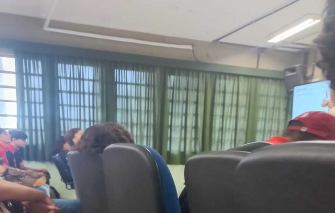

---

### 🤖 23/05/2024 – Tegra  
**Tema:** As possibilidades da IA no mercado de trabalho  
> Guilherme Bastos mostrou como a IA está transformando setores e incentivou a preparação para o futuro.

  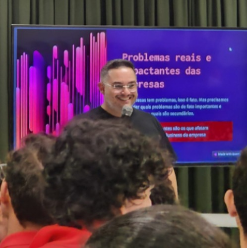

---

### 👥 27/05/2024 – Eduzz  
**Tema:** Liderança e Gestão 3.0  
> Victor Palencia trouxe novas abordagens de liderança para ambientes colaborativos.

  

---

### 🖥️ 18/06/2024 – Itix  
**Tema:** Explorando Homelabs  
> Bate-papo com estagiários e palestra sobre a importância de montar ambientes de desenvolvimento.

  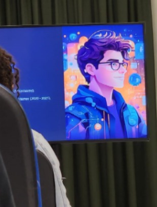

---

### 🛡️ 31/07/2024 – Eduzz  
**Tema:** Hacker do bem e a segurança digital no dia a dia  
> Luiz Milagres compartilhou dicas sobre segurança online e hackers éticos.

  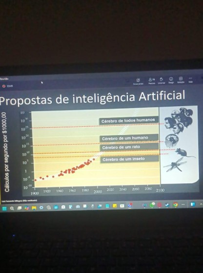

---

### 📂 28/08/2024 – Eduzz  
**Tema:** Você é uma pessoa organizada?  
> Dicas práticas de Vinicius e Michele para organização e produtividade.

  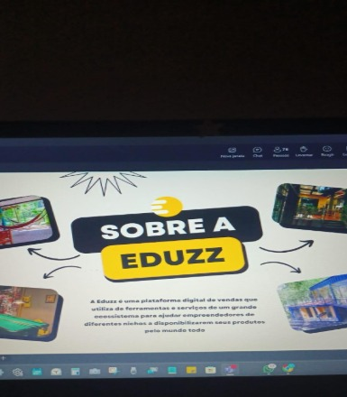

---

### 🚀 05/09/2024 – Tegra  
**Tema:** Tendências da área de TI com a virada da IA Generativa  
> Palestra de Guilherme Bastos sobre tecnologias emergentes.

  

---

### 🧠 13/09/2024 – Liliane Pereira  
**Tema:** Soft Skills e Hard Skills  
> Importância do equilíbrio entre habilidades interpessoais e técnicas.

  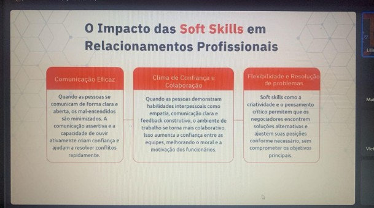

---

### 🪞 24/09/2024 – Eduzz  
**Tema:** Capricho: uma habilidade cada vez mais rara  
> Reflexões de Luiz Milagres sobre atenção aos detalhes no mercado de trabalho.

  

---

### 🏗️ 10/10/2024 – Tegra  
**Tema:** Desenvolvimento Low Code e No Code  
> Como democratizar a criação de soluções tecnológicas.

  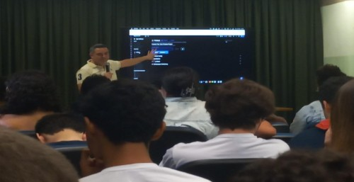

---

### 🌍 17/10/2024 – Fundação Iochpe 
**Tema:** Preparando-se para o amanhã  
> Flávia Freitas destacou como transformar experiências acadêmicas em oportunidades globais.

  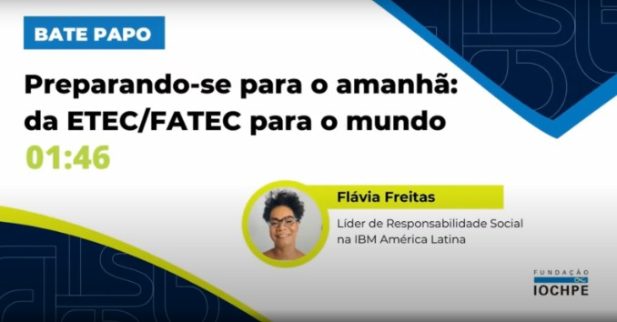

---

## 📆 Palestras de 2025

### 💼 10/04/2025 – Eduzz  
**Tema:** Desafios do primeiro emprego em TI e como superá-los  
> Tiago Baldo trouxe estratégias para enfrentar os desafios do início de carreira.

  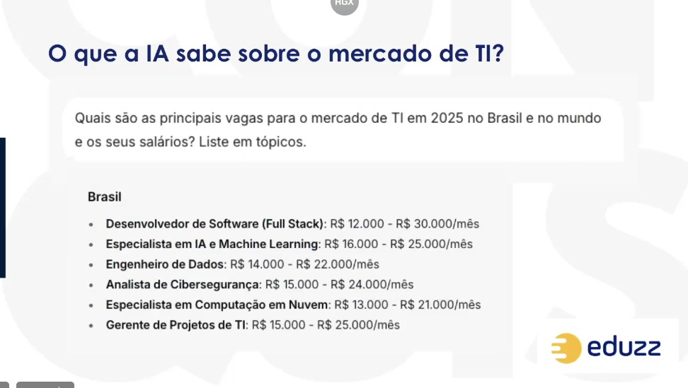

---

### 💻 16/04/2025 – ITIX  
**Tema:** Carreira e Suporte na Prática  
> Bate-papo com profissionais da ITIX sobre os desafios do mercado.

---

### 🌐 23/04/2025 – Eduzz  
**Tema:** LinkedIn e Marca Pessoal para Profissionais de TI  
> Uso estratégico do LinkedIn e fortalecimento da marca pessoal.

  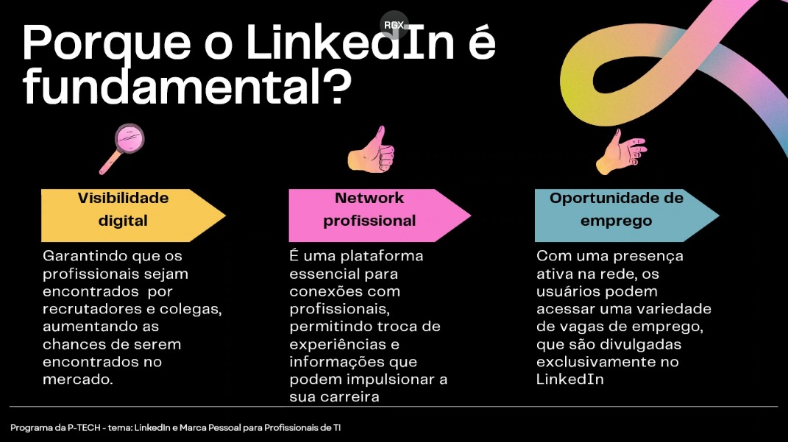

---

### 🤖 12/05/2025 – Prof. Dilenardo Piva Júnior  
**Tema:** Inteligência Artificial  
> Abordou impactos da IA no presente e no futuro da tecnologia.

  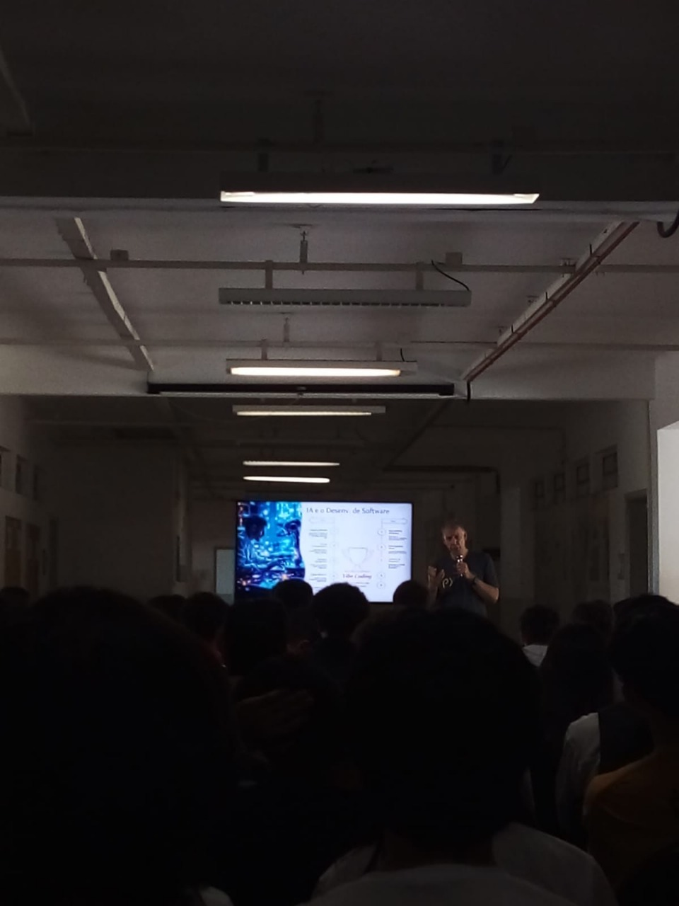

---

### 🚀 13/05/2025 – Eduzz  
**Tema:** Empreendedorismo e Inovação na Tecnologia  
> Luciana Ogusco incentivou mentalidade inovadora e empreendedora.

  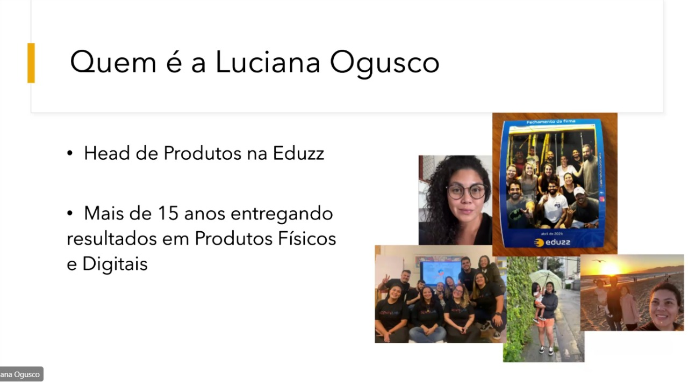

---

### 📈 20/08/2025 – Eduzz  
**Tema:** Produtividade e Organização no Dia a Dia  
> Estratégias para melhorar a produtividade pessoal e profissional.

---

### 🗄️ 27/08/2025 – ITIX  
**Tema:** Treinamento de Banco de Dados  
> Ministrado por Andrea Maria Fieri, Raissa Brito Miranda e Rafael Santos, sobre fundamentos de BD.

  

---

### 🔒 03/09/2025 – Eduzz  
**Tema:** Segurança de Informação e Cibersegurança  
> Guilherme Rodrigues Mattos abordou práticas e prevenção para proteção de dados.

  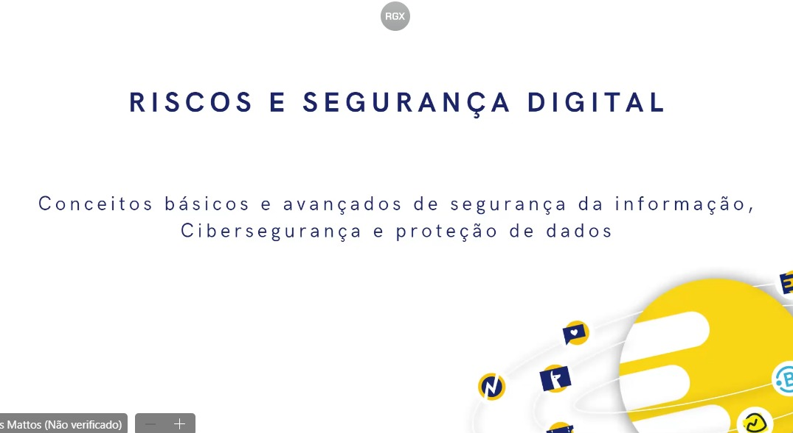

---

### 🤖 16/09/2025 – Eduzz  
**Tema:** Inteligência Artificial na Prática  
> Palestra **online pelo Teams** com **Daiany Santos** e **Lucas Lascasas**, destacando aplicações práticas da IA.

  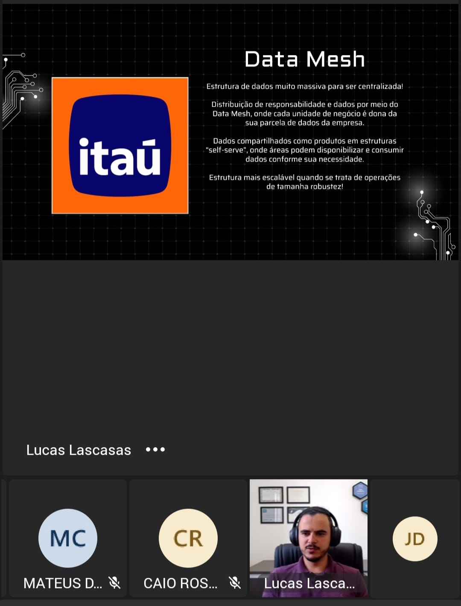

---

## 🏆 Conclusão
Essas experiências foram fundamentais para meu desenvolvimento acadêmico e profissional, ampliando meu **conhecimento em TI** e fortalecendo minhas habilidades para os desafios do futuro.

> _“A educação é a arma mais poderosa que você pode usar para mudar o mundo.” – Nelson Mandela_

---

## 📬 Contato
- **GitHub:** [JuliaDini](https://github.com/JuliaDini)

  

