<!-- Banner ondulado -->

  

<!-- Lacinhos e nome -->

  ✧･ﾟ: *✧･ﾟ:* ✧･ﾟ: *✧･ﾟ: *✧･ﾟ: *✧･ﾟ:* ✧･ﾟ: *✧･ﾟ: *✧･ﾟ: *✧･ﾟ:* ✧･ﾟ: *✧･ﾟ: *✧･ﾟ: *✧･ﾟ:* ✧･ﾟ: *✧･ﾟ:*  

  <strong>Olá!  Bem-vindo(a) ao meu Portfólio!</strong>

  ___________________________________________  

  <strong>Sou a: </strong>  

<!-- Animação de digitação -->

  

  ✧･ﾟ: *✧･ﾟ:* ✧･ﾟ: *✧･ﾟ: *✧･ﾟ: *✧･ﾟ:* ✧･ﾟ: *✧･ﾟ: *✧･ﾟ: *✧･ﾟ:* ✧･ﾟ: *✧･ﾟ: *✧･ﾟ: *✧･ﾟ:* ✧･ﾟ: *✧･ﾟ:*    

---

## 📚 Sumário de Palestras e Certificados
- [Introdução](#-introdução)
- [Palestras de 2024](#-palestras-de-2024)
- [Palestras de 2025](#-palestras-de-2025)
- [Palestras de 2026](#-palestras-de-2026)
- [Certificados](#-certificados)
- [Conclusão](#-conclusão)
- [Contato](#-contato)

---

## 📍 Introdução
> 💡 **Bem-vindo(a) ao meu portfólio de palestras e certificações!**

Atualmente sou estudante do **3º ano de Desenvolvimento de Sistemas na ETEC Fernando Prestes** e atuo como **Estagiária de Administração na Prefeitura Municipal de Sorocaba** (Divisão de Licitação).

Este espaço reúne os **aprendizados, experiências e certificações** adquiridos através das palestras e capacitações das quais participei entre **2024 e 2026**. Além dos resumos, compartilho **insights práticos e reflexões pessoais** que mostram como aplico esses conhecimentos na minha jornada de desenvolvimento pessoal e profissional em TI.

Organizei os conteúdos em **ordem cronológica**, formando uma **linha do tempo de aprendizado contínuo**.

---

## 📆 Palestras de 2024

### ✨ 08/04/2024 – Itix  
**Tema:** Criatividade e Inovação: Um Desafio Constante  
> Palestra destacando a importância da criatividade e adaptação às mudanças do mercado.

  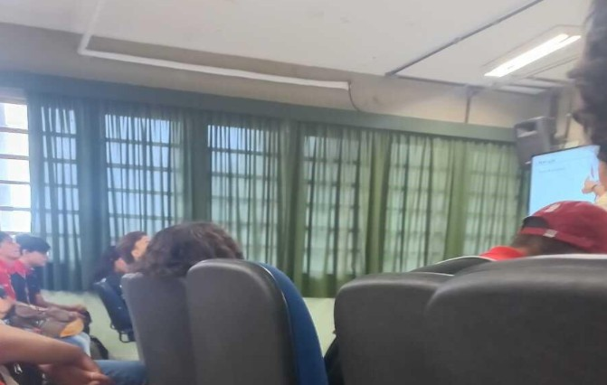

---

### 🤖 23/05/2024 – Tegra  
**Tema:** As possibilidades da IA no mercado de trabalho  
> Guilherme Bastos mostrou como a IA está transformando setores e incentivou a preparação para o futuro.

  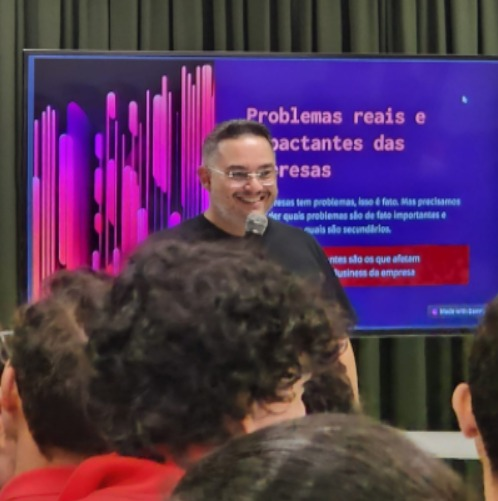

---

### 👥 27/05/2024 – Eduzz  
**Tema:** Liderança e Gestão 3.0  
> Victor Palencia trouxe novas abordagens de liderança para ambientes colaborativos.

  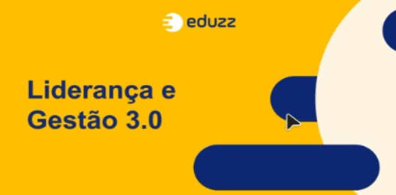

---

### 🖥️ 18/06/2024 – Itix  
**Tema:** Explorando Homelabs  
> Bate-papo com estagiários e palestra sobre a importância de montar ambientes de desenvolvimento.

  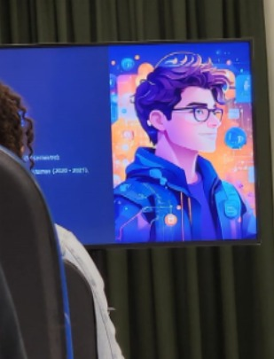

---

### 🛡️ 31/07/2024 – Eduzz  
**Tema:** Hacker do bem e a segurança digital no dia a dia  
> Luiz Milagres compartilhou dicas sobre segurança online e hackers éticos.

  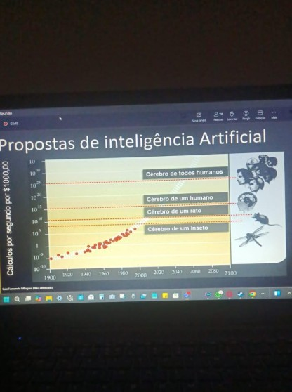

---

### 📂 28/08/2024 – Eduzz  
**Tema:** Você é uma pessoa organizada?  
> Dicas práticas de Vinicius e Michele para organização e produtividade.

  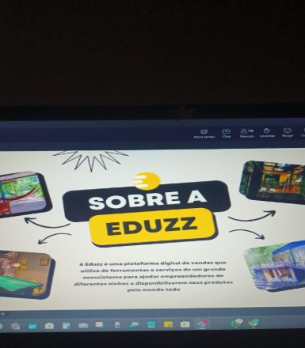

---

### 🚀 05/09/2024 – Tegra  
**Tema:** Tendências da área de TI com a virada da IA Generativa  
> Palestra de Guilherme Bastos sobre tecnologias emergentes.

  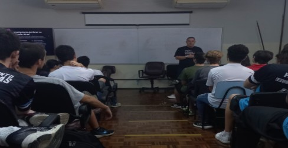

---

### 🧠 13/09/2024 – Liliane Pereira  
**Tema:** Soft Skills e Hard Skills  
> Importância do equilíbrio entre habilidades interpessoais e técnicas.

  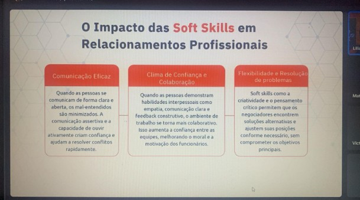

---

### 🪞 24/09/2024 – Eduzz  
**Tema:** Capricho: uma habilidade cada vez mais rara  
> Reflexões de Luiz Milagres sobre atenção aos detalhes no mercado de trabalho.

  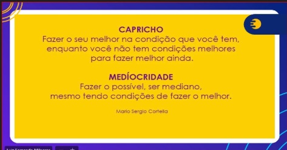

---

### 🏗️ 10/10/2024 – Tegra  
**Tema:** Desenvolvimento Low Code e No Code  
> Como democratizar a criação de soluções tecnológicas.

  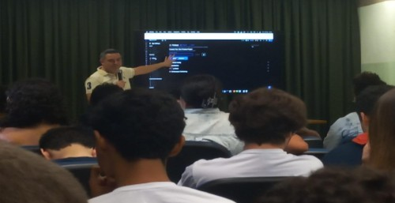

---

### 🌍 17/10/2024 – Fundação Iochpe  
**Tema:** Preparando-se para o amanhã  
> Flávia Freitas destacou como transformar experiências acadêmicas em oportunidades globais.

  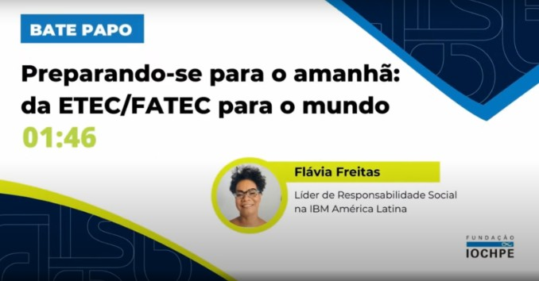

---

## 📆 Palestras de 2025

### 💼 10/04/2025 – Eduzz  
**Tema:** Desafios do primeiro emprego em TI e como superá-los  
> Tiago Baldo trouxe estratégias para enfrentar os desafios do início de carreira.

  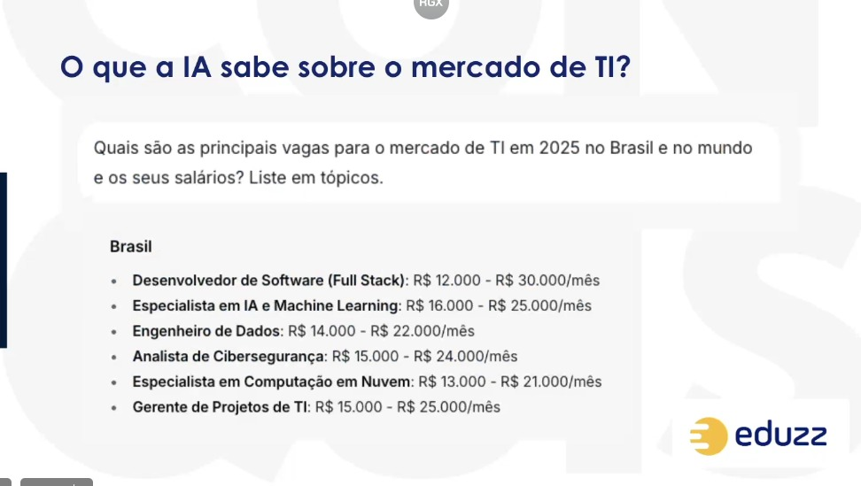

---

### 💻 16/04/2025 – ITIX  
**Tema:** Carreira e Suporte na Prática  
> Bate-papo com profissionais da ITIX sobre os desafios do mercado.

---

### 🌐 23/04/2025 – Eduzz  
**Tema:** LinkedIn e Marca Pessoal para Profissionais de TI  
> Uso estratégico do LinkedIn e fortalecimento da marca pessoal.

  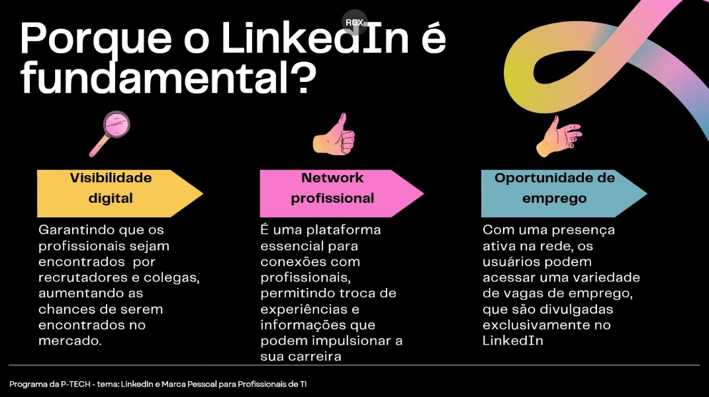

---

### 🤖 12/05/2025 – Prof. Dilenardo Piva Júnior  
**Tema:** Inteligência Artificial  
> Abordou impactos da IA no presente e no futuro da tecnologia.

  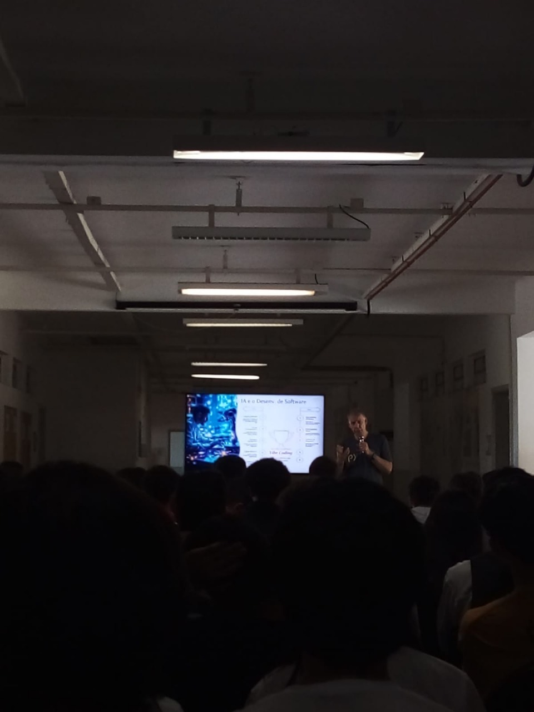

---

### 🚀 13/05/2025 – Eduzz  
**Tema:** Empreendedorismo e Inovação na Tecnologia  
> Luciana Ogusco incentivou mentalidade inovadora e empreendedora.

  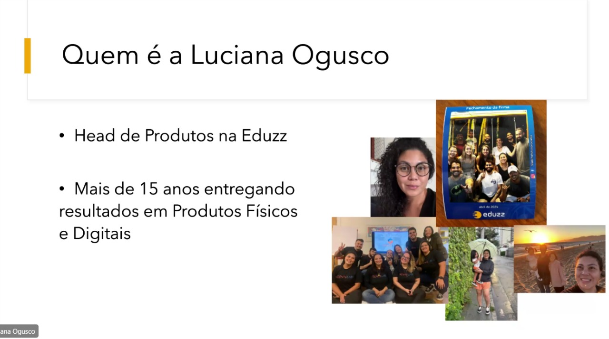

---

### 📈 20/08/2025 – Eduzz  
**Tema:** Produtividade e Organização no Dia a Dia  
> Estratégias para melhorar a produtividade pessoal e profissional.

---

### 🗄️ 27/08/2025 – ITIX  
**Tema:** Treinamento de Banco de Dados  
> Ministrado por Andrea Maria Fieri, Raissa Brito Miranda e Rafael Santos, sobre fundamentos de BD.

  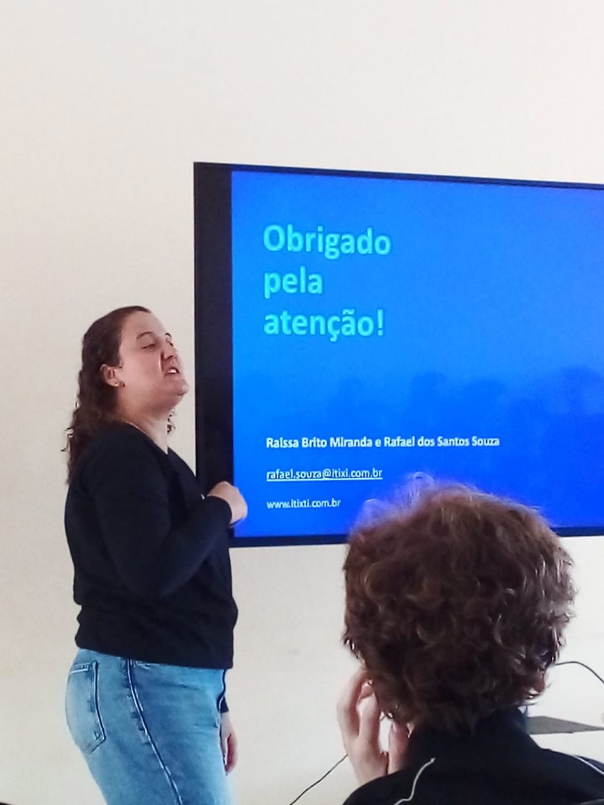

---

### 🔒 03/09/2025 – Eduzz  
**Tema:** Segurança de Informação e Cibersegurança  
> Guilherme Rodrigues Mattos abordou práticas e prevenção para proteção de dados.

  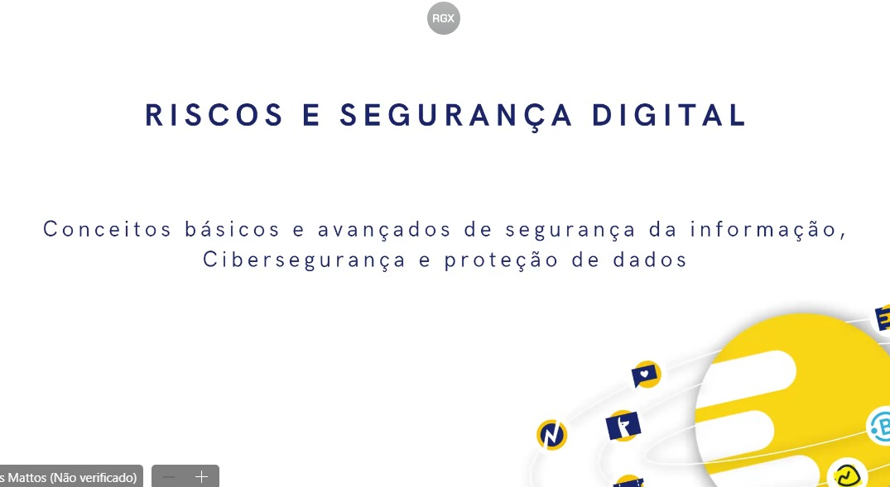

---

### 🤖 16/09/2025 – Eduzz  
**Tema:** Inteligência Artificial na Prática  
> Palestra online pelo Teams com Daiany Santos e Lucas Lascasas, destacando aplicações práticas da IA.

  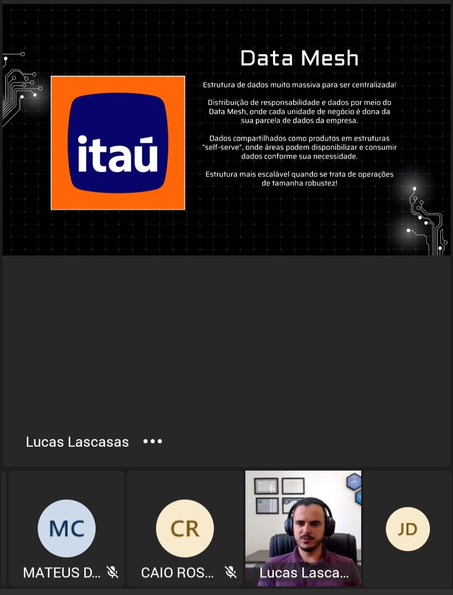

---

## 📆 Palestras de 2026

### 🛠️ 10/06/2026 – ITIX  
**Tema:** Analista de Suporte na Prática  
> Abordagem sobre tipos de suporte, desafios da gestão, tipos de chamado, fluxo de atendimento e suporte focado em TI.

  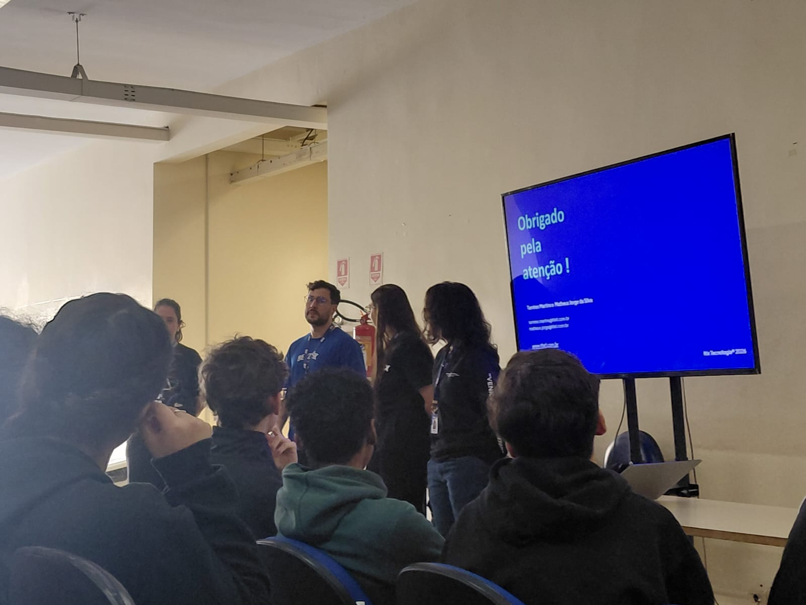

---

### 💼 11/08/2026 – ITIX  
**Tema:** LinkedIn e Currículo  
> Orientações valiosas sobre como montar um bom perfil no LinkedIn, elaborar um currículo atraente e administrar o repositório no GitHub.

  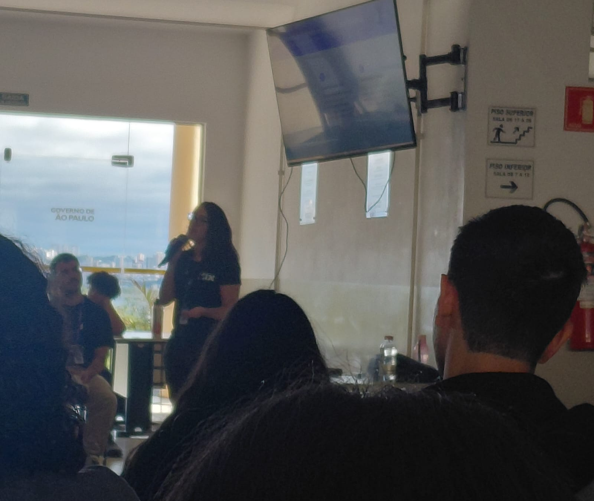

---

## 🎓 Certificados

### 📜 Atividade de Contextualização Profissional
> **Instituição:** Fundação Iochpe - Formare  
> **Emissão:** Novembro / 2024

  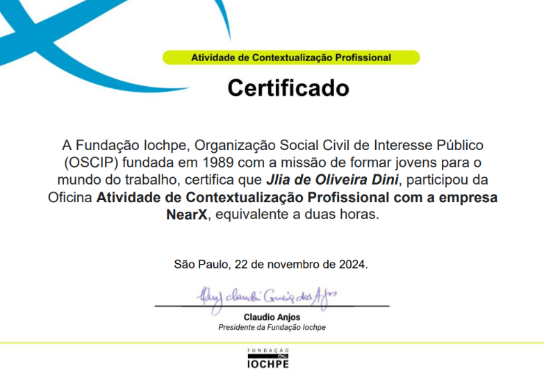

---

### 📜 Criatividade e Inovação
> **Instituição:** Fundação Iochpe - Formare  
> **Emissão:** Junho / 2026

  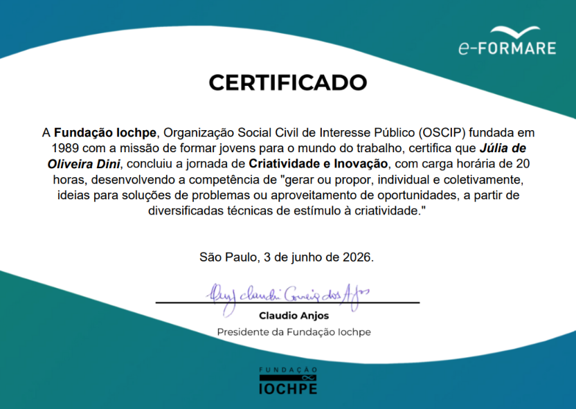

---

### 📜 1º Desafio 24 Horas de Inovação Global
> **Instituição:** INOVA CPS  
> **Data:** 18/03/2026 (Carga horária: 24 horas)  
> Participação no desafio focado em inovação e resolução de problemas promovido pelo Centro Paula Souza.

  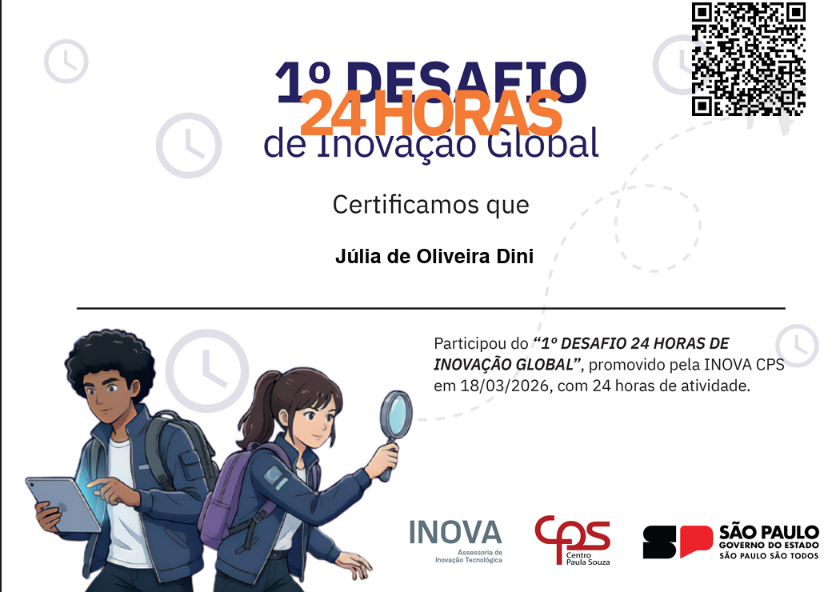

---

### 🏆 Prémio Destaque na Escola - Menção Honrosa (CUCO USP)
> **Instituição:** Universidade de São Paulo (USP / IFSC) - Programa Vem Saber  
> **Emissão:** 09/09/2025  
> Reconhecimento pelo desempenho na 9ª Edição da Competição USP de Conhecimentos e Oportunidades (CUCO).

  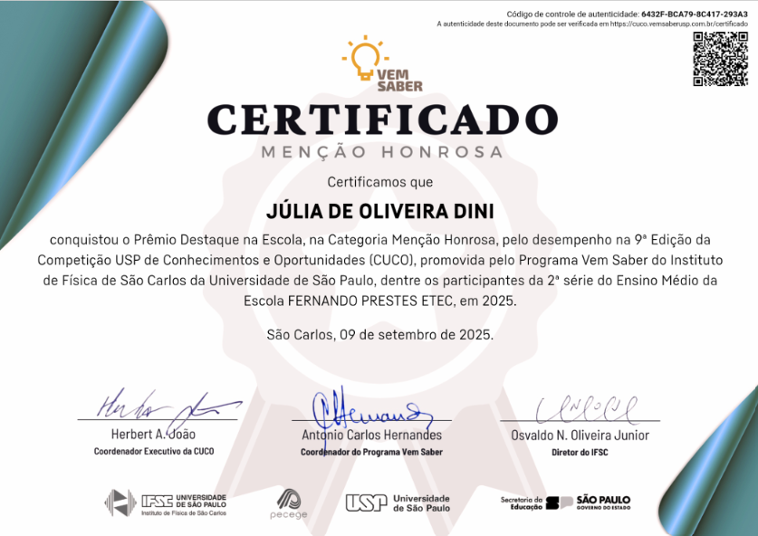

---

## 🏆 Conclusão
Essas experiências e certificações foram fundamentais para o meu desenvolvimento acadêmico e profissional, ampliando o meu **conhecimento em TI** e fortalecendo as minhas habilidades para os desafios do futuro.

> _“A educação é a arma mais poderosa que você pode usar para mudar o mundo.” – Nelson Mandela_

---

## 📬 Contato
- **GitHub:** [JuliaDini](https://github.com/JuliaDini)
- **LinkedIn:** [Júlia de Oliveira Dini](https://www.linkedin.com/in/júlia-de-oliveira-dini-588894437)

  

